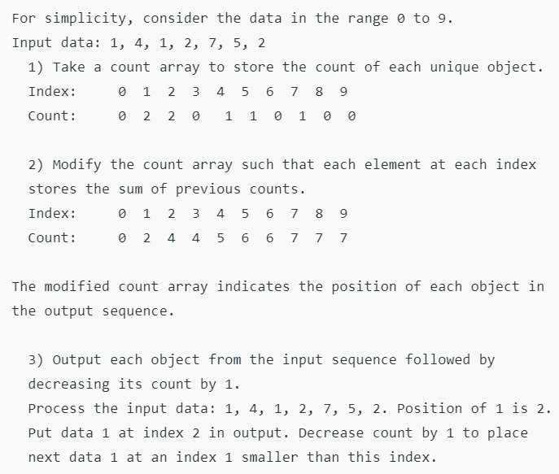
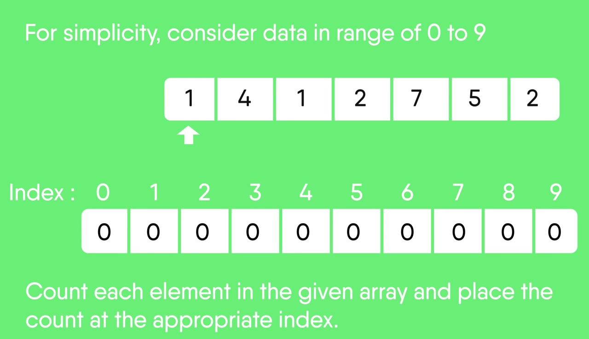
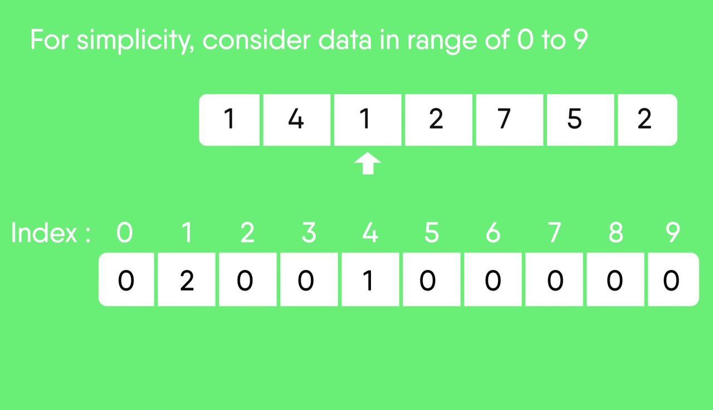
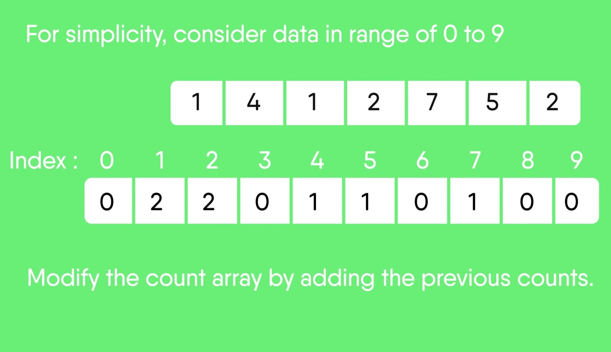
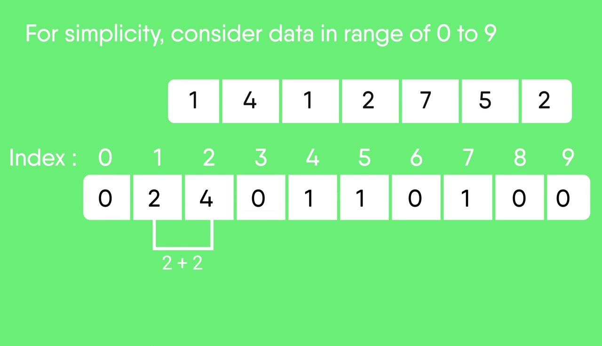
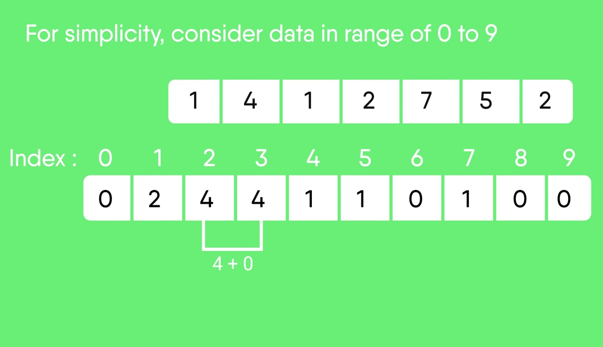
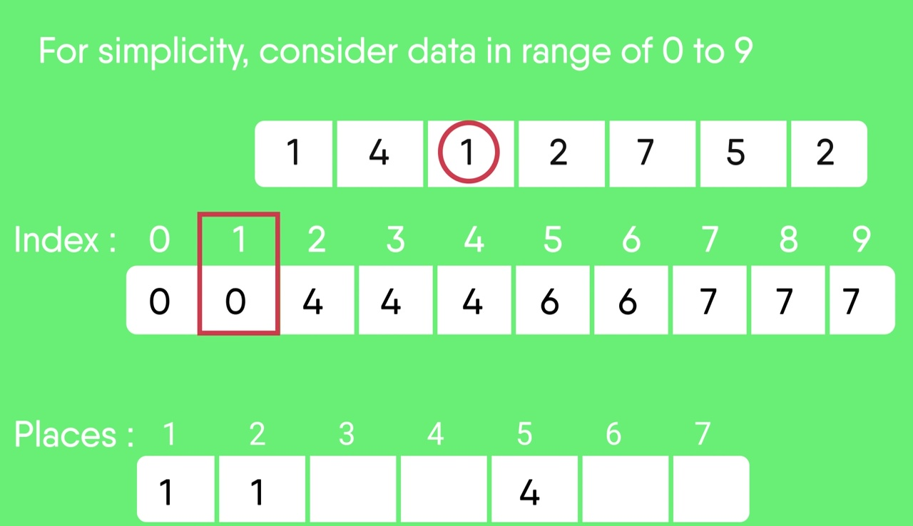
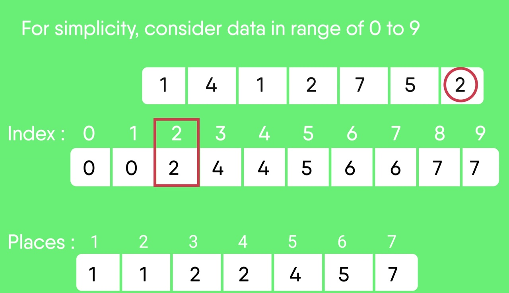

Counting Sort

Counting sort is a sorting technique based on keys between a specific range. It works by counting the number of objects having distinct key values (kind of hashing). Then doing some arithmetic to calculate the position of each object in the output sequence.
Let us understand it with the help of an example. 

Points to be noted:
1. Counting sort is efficient if the range of input data is not significantly greater than the number of objects to be sorted. Consider the situation where the input sequence is between range 1 to 10K and the data is 10, 5, 10K, 5K.
2. It is not a comparison based sorting. It running time complexity is O(n) with space proportional to the range of data.
3. It is often used as a sub-routine to another sorting algorithm like radix sort.
4. Counting sort uses a partial hashing to count the occurrence of the data object in O(1).
5. Counting sort can be extended to work for negative inputs also.

