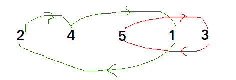
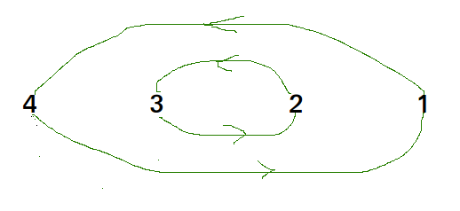

Cycle Sort

Cycle sort is an in-place sorting Algorithm, unstable sorting algorithm, a comparison sort that is theoretically optimal in terms of the total number of writes to the original array.

It is optimal in terms of number of memory writes. It minimizes the number of memory writes to sort (Each value is either written zero times, if it’s already in its correct position, or written one time to its correct position.)
It is based on the idea that array to be sorted can be divided into cycles. Cycles can be visualized as a graph. We have n nodes and an edge directed from node i to node j if the element at i-th index must be present at j-th index in the sorted array.
Cycle in arr[] = {2, 4, 5, 1, 3} 

Cycle in arr[] = {4, 3, 2, 1} 

We one by one consider all cycles. We first consider the cycle that includes first element. We find correct position of first element, place it at its correct position, say j. We consider old value of arr[j] and find its correct position, we keep doing this till all elements of current cycle are placed at correct position, i.e., we don’t come back to cycle starting point.

Time Complexity : O(n2)

Worst Case : O(n2)

Average Case: O(n2)

Best Case : O(n2)

This sorting algorithm is best suited for situations where memory write or swap operations are costly. 