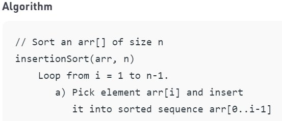
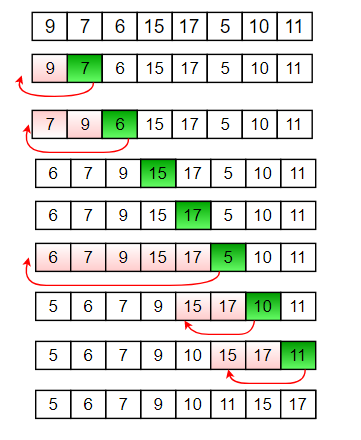

Recursive Insertion Sort

Difficulty Level : Easy

Insertion sort is a simple sorting algorithm that works the way we sort playing cards in our hands.

Below is an iterative algorithm for insertion sort

Example:

How to implement it recursively?
Recursive Insertion Sort has no performance/implementation advantages, but can be a good question to check one’s understanding of Insertion Sort and recursion.
If we take a closer look at Insertion Sort algorithm, we keep processed elements sorted and insert new elements one by one in the inserted array.
Recursion Idea.

Base Case: If array size is 1 or smaller, return.

Recursively sort first n-1 elements.

Insert last element at its correct position in sorted array.