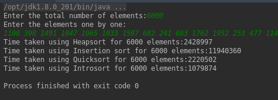

Introsort or Introspective Sort

Introsort(Introspective sort) is a comparison based sort that consists of three sorting phases. They are Quicksort, Heapsort, and Insertion sort. Basic concepts of Introsort and the C++ code are available here

The following section shows how the Introsort algorithm is formulated, after reviewing the pros and cons of the respective algorithms.

Quicksort

The Quicksort is an efficient sorting algorithm but has the worst-case performance of O(N ^ 2) comparisons with O(N) auxiliary space. This worst-case complexity depends on two phases of the Quicksort algorithm.

1. Choosing the pivot element

2. Recursion depth during the course of the algorithm

   Heapsort

   Heapsort has O(N log N) worst-case time complexity, which is much better than the worst case of Quicksort. So, is it evident that Heapsort is the best? No, the secret of Quicksort is that it does not swap already elements that are already in order, which is unnecessary, whereas with the Heapsort, even if all of the data is already sorted, the algorithm swaps all of the elements to order the array. Also, by choosing the optimal pivot, the worst-case of O(N ^ 2) can be avoided in quicksort. But, the swapping will pay more time in the case of Heapsort that is unavoidable. Hence, Quicksort outperforms Heapsort.
   The best things about Heapsort is that, if the recursion depth becomes too large like (log N), the worst case complexity would be still O(N log N).
   Mergesort
   The Mergesort has the worst case complexity only as O(N log N). Mergesort can work well on any type of data sets irrespective of its size whereas the Quicksort cannot work well with large data sets. But, Mergesort is not in-place whereas Quicksort is in-place, and that plays a vital role in here. Mergesort goes well with LinkedLists whereas Quicksort goes well with arrays. The locality of reference is better with Quicksort, whereas with Mergesort it is bad. So, for conventional purposes, having memory constraints in hand, Quicksort outperforms Mergesort.
   Insertion sort
   The main advantage of the insertion sort is its simplicity. It also exhibits a good performance when dealing with a small list. The insertion sort is an in-place sorting algorithm so the space requirement is minimal. The disadvantage of the insertion sort is that it does not perform as well as the other sorting algorithms when the size of the data gets larger.

Here is how Introsort is formulated:

Choosing the right sorting algorithm depends on the occasion where the sorting algorithm is being used. There are a good number of sorting algorithms in hand already that has pros and cons of its own. So, to get a better sorting algorithm, the solution is to tweak the existing algorithms and produce a new sorting algorithm that works better. There are a lot of hybrid algorithms, that outperforms the general sorting algorithms. One such is the Introsort. The best versions of Quicksort are competitive with both heap sort and merge sort on the vast majority of inputs. Rarely Quicksort has the worst case of O(N ^ 2) running time and O(N) stack usage. Both Heapsort and Mergesort have O(N log N) worst-case running time, together with a stack usage of O(1) for Heapsort and O(log N) for Mergesort respectively. Also, Insertion sort performs better than any of the above algorithms if the data set is small.

Combining all the pros of the sorting algorithms, Introsort behaves based on the data set.

If the number of elements in the input gets fewer, the Introsort performs Insertion sort for the input.

Having the least number of comparisons(Quicksort) in mind, for splitting the array by finding the pivot element, Quicksort is used. Quoted earlier, the worst case of Quicksort is based on the two phases and here is how we can fix them.

Choosing the pivot element: We can use either of median-of-3 concept or randomized pivot concept or middle as the pivot concept for finding the pivot element

Recursion depth during the course of the algorithm: When the recursion depth gets higher, Introsort uses Heapsort as it has the definite upper bound of O(N log N).

How does depthLimit work?

depthLimit represents maximum depth for recursion. It is typically chosen as log of length of input array (please refer below implementation). The idea is to ensure that the worst case time complexity remains O(N log N). Note that the worst-case time complexity of HeapSort is O(N log N).

Why is Mergesort not used?

As the arrays are being dealt with the in-place concept where Quicksort outperforms Mergesort, we are not using Mergesort.

Can Introsort be applied everywhere?

If the data won’t fit in an array, Introsort cannot be used.

Furthermore, like Quicksort and Heapsort, Introsort is not stable. When a stable sort is needed, Introsort cannot be applied.

Is Introsort the only hybrid sorting algorithm?

No. There are other hybrid sorting algorithms like Hybrid Mergesort, Tim sort, Insertion-Merge hybrid.

Comparison of Heapsort, Insertion sort, Quicksort, Introsort while sorting 6000 elements(in milliseconds).

Pseudocode:

sort(A : array):

depthLimit = 2xfloor(log(length(A)))

introsort(A, depthLimit)

introsort(A, depthLimit):

n = length(A)

if n<=16:

insertionSort(A)

if depthLimit == 0:

heapsort(A)

else:

        // using quick sort, the
        // partition point is found 
p = partition(A)  
introsort(A[0:p-1], depthLimit - 1)
introsort(A[p+1:n], depthLimit - 1)

Time Complexity:
Worst-case performance: O(nlogn) (better than Quicksort)

Average-case performance: O(nlogn)

In the Quicksort phase, the pivot can either be chosen using the median-of-3 concept or last element of the array. For data that has a huge number of elements, median-of-3 concept slows down the running time of the Quicksort.

In the example described below, the quicksort algorithm calculates the pivot element based on the median-of-3 concept. 

