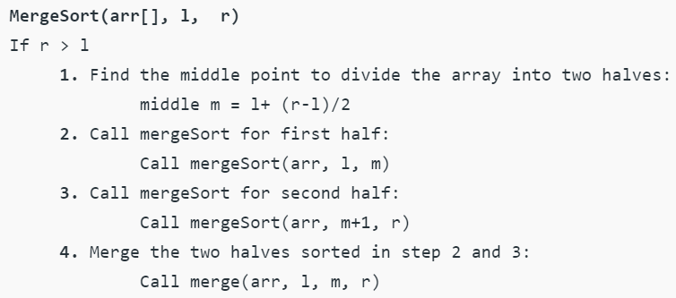
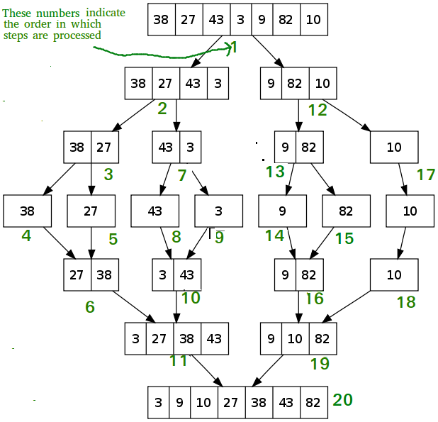
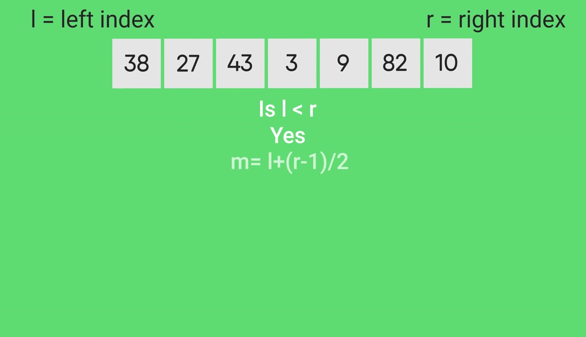
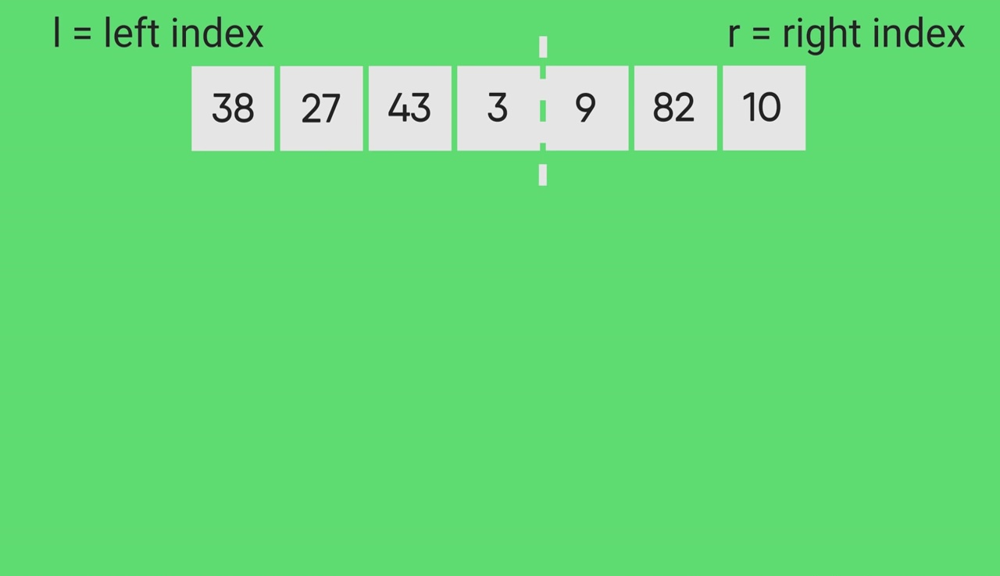
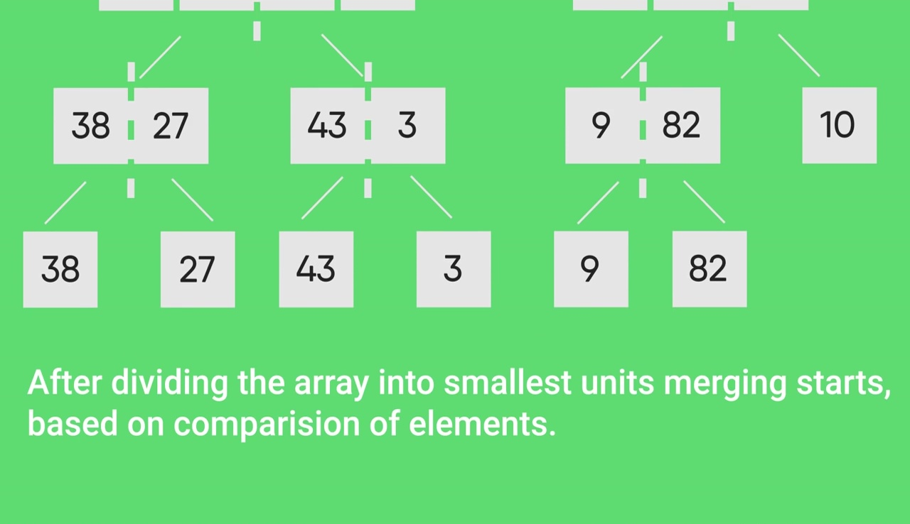
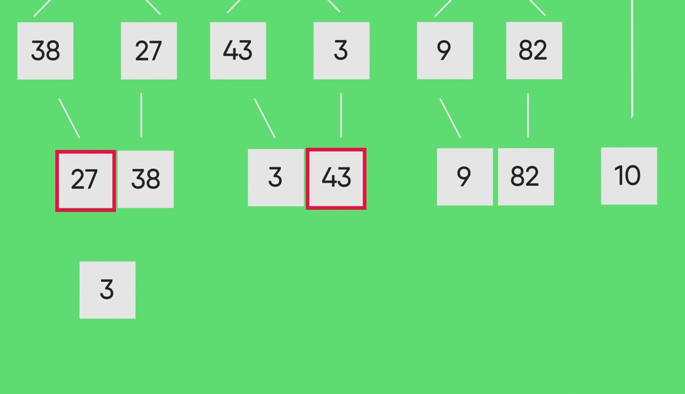
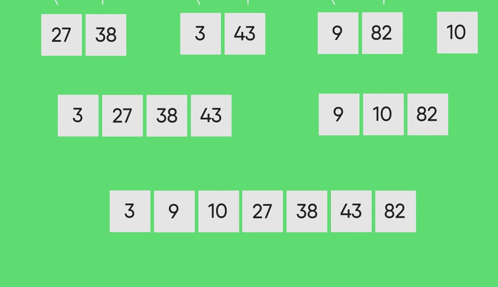

Merge Sort

Difficulty Level : Medium

Like QuickSort, Merge Sort is a Divide and Conquer algorithm. It divides the input array into two halves, calls itself for the two halves, and then merges the two sorted halves. The merge() function is used for merging two halves. The merge(arr, l, m, r) is a key process that assumes that arr[l..m] and arr[m+1..r] are sorted and merges the two sorted sub-arrays into one. See the following C implementation for details.

The following diagram from wikipedia shows the complete merge sort process for an example array {38, 27, 43, 3, 9, 82, 10}. If we take a closer look at the diagram, we can see that the array is recursively divided in two halves till the size becomes 1. Once the size becomes 1, the merge processes come into action and start merging arrays back till the complete array is merged.

Time Complexity: Sorting arrays on different machines. Merge Sort is a recursive algorithm and time complexity can be expressed as following recurrence relation.

T(n) = 2T(n/2) + θ(n)

The above recurrence can be solved either using the Recurrence Tree method or the Master method. It falls in case II of Master Method and the solution of the recurrence is θ(nLogn). Time complexity of Merge Sort is  θ(nLogn) in all 3 cases (worst, average and best) as merge sort always divides the array into two halves and takes linear time to merge two halves.

Auxiliary Space: O(n)

Algorithmic Paradigm: Divide and Conquer

Sorting In Place: No in a typical implementation

Stable: Yes

Applications of Merge Sort

Merge Sort is useful for sorting linked lists in O(nLogn) time.In the case of linked lists, the case is different mainly due to the difference in memory allocation of arrays and linked lists. Unlike arrays, linked list nodes may not be adjacent in memory. Unlike an array, in the linked list, we can insert items in the middle in O(1) extra space and O(1) time. Therefore, the merge operation of merge sort can be implemented without extra space for linked lists.

In arrays, we can do random access as elements are contiguous in memory. Let us say we have an integer (4-byte) array A and let the address of A[0] be x then to access A[i], we can directly access the memory at (x + i*4). Unlike arrays, we can not do random access in the linked list. Quick Sort requires a lot of this kind of access. In a linked list to access i’th index, we have to travel each and every node from the head to i’th node as we don’t have a continuous block of memory. Therefore, the overhead increases for quicksort. Merge sort accesses data sequentially and the need of random access is low.

Inversion Count Problem

Used in External Sorting

Drawbacks of Merge Sort

Slower comparative to the other sort algorithms for smaller tasks.

Merge sort algorithm requires additional memory space of 0(n) for the temporary array .

It goes through the whole process even if the  array is sorted.

