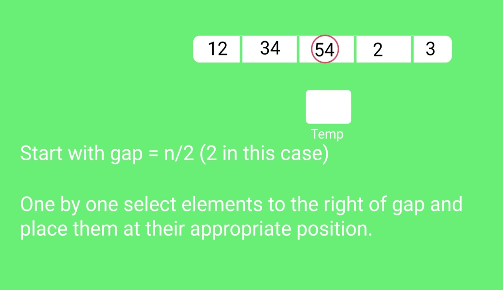
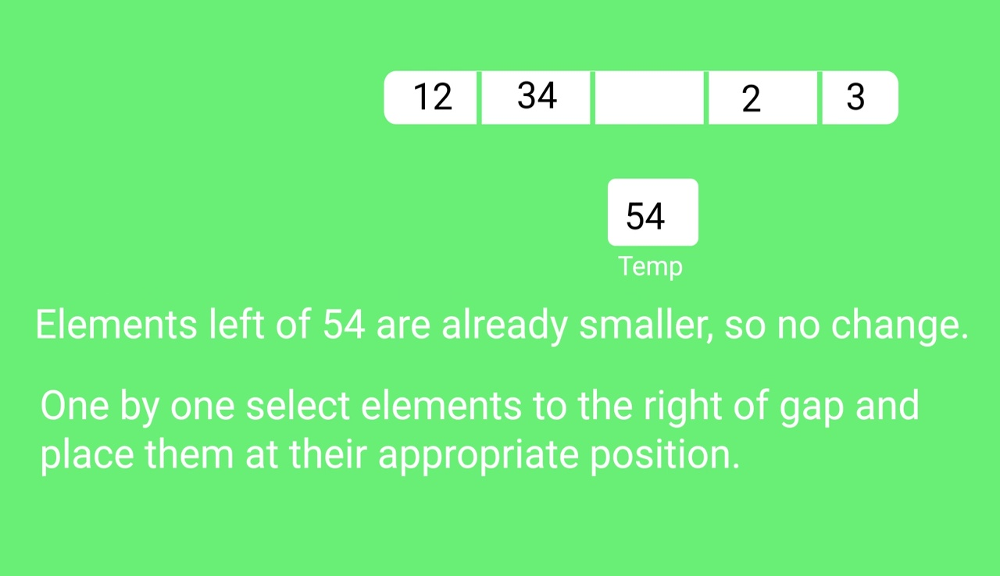
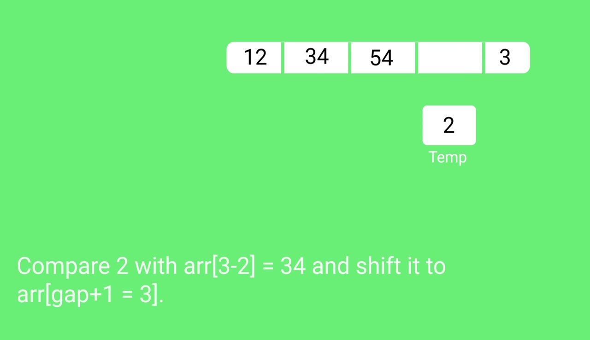
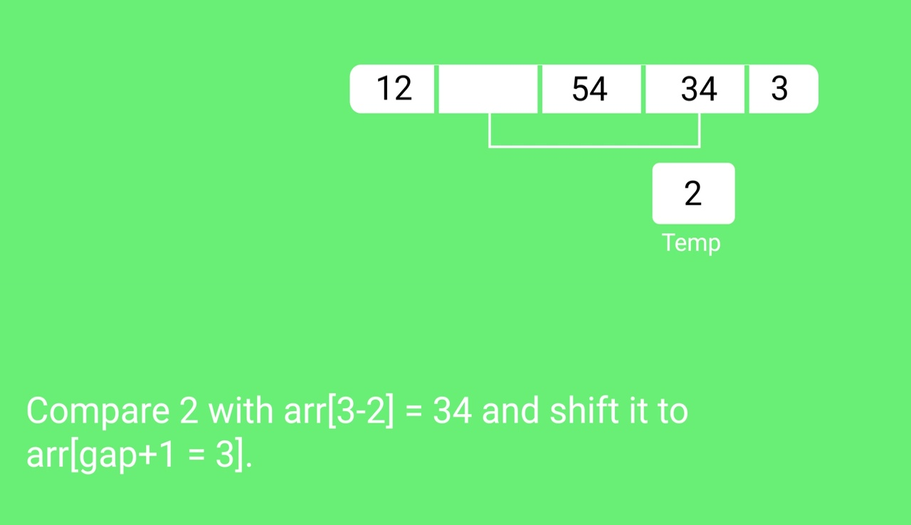
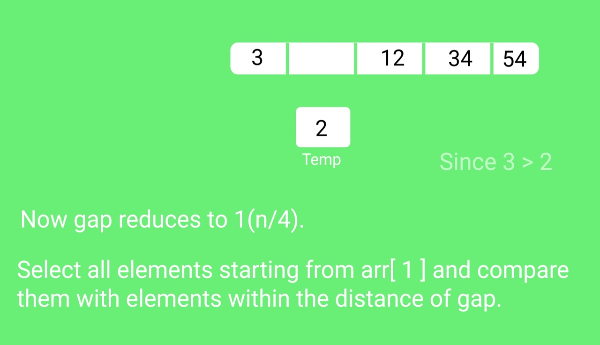
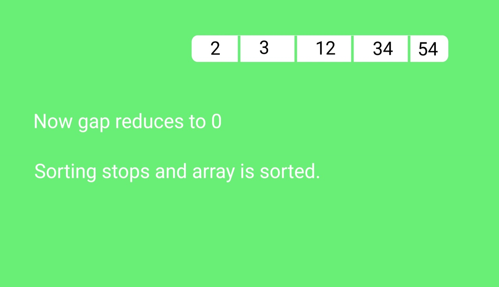

Shell Sort

ShellSort is mainly a variation of Insertion Sort. In insertion sort, we move elements only one position ahead. When an element has to be moved far ahead, many movements are involved. The idea of shellSort is to allow exchange of far items. In shellSort, we make the array h-sorted for a large value of h. We keep reducing the value of h until it becomes 1. An array is said to be h-sorted if all sublists of every h’th element is sorted.
Time Complexity: Time complexity of above implementation of shellsort is O(n2). In the above implementation gap is reduce by half in every iteration. There are many other ways to reduce gap which lead to better time complexity.

