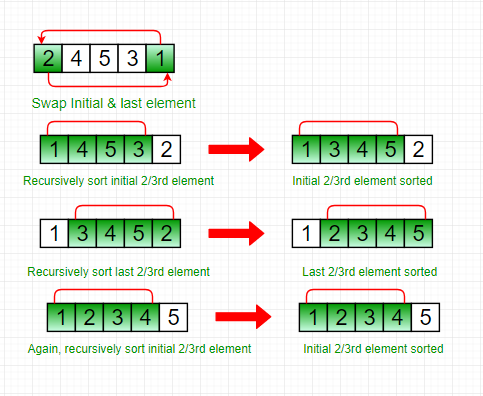

Stooge Sort

The Stooge sort is a recursive sorting algorithm. It is defined as below (for ascending order sorting).

Step 1 : If value at index 0 is greater than

value at last index, swap them.

Step 2:  Recursively,

a) Stooge sort the initial 2/3rd of the array.

b) Stooge sort the last 2/3rd of the array.

c) Stooge sort the initial 2/3rd again to confirm.

NOTE: Always take the ceil of ((2/3)*N) for selecting elements.

Recommended: Please try your approach on {IDE} first, before moving on to the solution.

Illustration:

Input :   2 4 5 3 1

Output : 1 2 3 4 5

Explanation:

Initially, swap 2 and 1 following above step 1.

1 4 5 3 2

Now, recursively sort initial 2/3rd of the elements.

1 4 5 3 2

1 3 4 5 2

Then, recursively sort last 2/3rd of the elements.

1 3 4 5 2

1 2 3 4 5

Again, sort the initial 2/3rd of the elements to confirm final data is sorted.

1 2 3 4 5

The running time complexity of stooge sort can be written as,

T(n) = 3T(3n/2) + ?(1)

Solution of above recurrence is O(n(log3/log1.5)) = O(n2.709), hence it is slower than even bubble sort(n^2). 