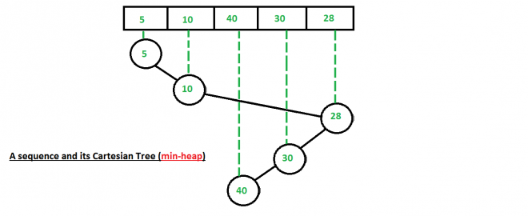
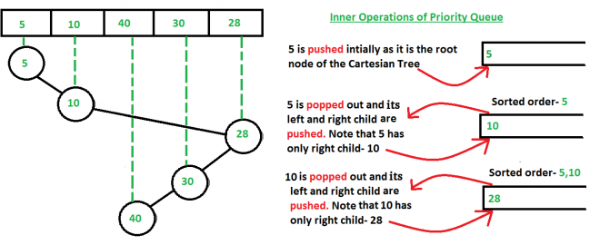
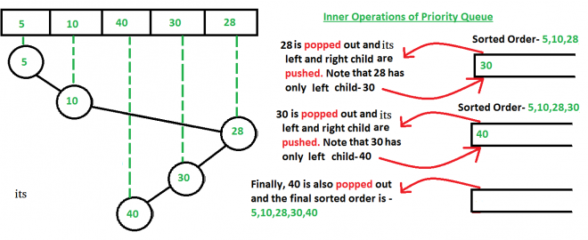
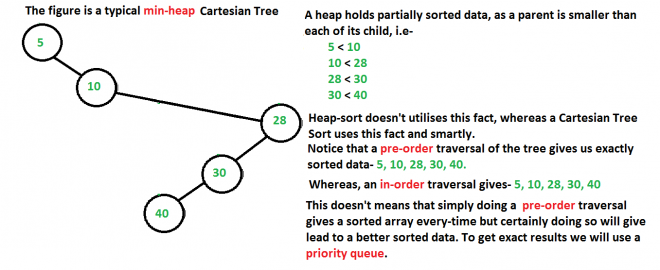

Cartesian Tree Sort

Cartesian Sort is an Adaptive Sorting as it sorts the data faster if data is partially sorted. In fact, there are very few sorting algorithms that make use of this fact.

For example consider the array {5, 10, 40, 30, 28}. The input data is partially sorted too as only one swap between “40” and “28” results in a completely sorted order. See how Cartesian Tree Sort will take advantage of this fact below.

Below are steps used for sorting.

Step 1 : Build a (min-heap) Cartesian Tree from the given input sequence.

Step 2 : Starting from the root of the built Cartesian Tree, we push the nodes in a priority queue.

Then we pop the node at the top of the priority queue and push the children of the popped node in the priority queue in a pre-order manner.

Pop the node at the top of the priority queue and add it to a list.

Push left child of the popped node first (if present).

Push right child of the popped node next (if present).

How to build (min-heap) Cartesian Tree?

Building min-heap is similar to building a (max-heap) Cartesian Tree (discussed in previous post), except the fact that now we scan upward from the node’s parent up to the root of the tree until a node is found whose value is smaller (and not larger as in the case of a max-heap Cartesian Tree) than the current one and then accordingly reconfigure links to build the min-heap Cartesian tree.

Why not to use only priority queue?

One might wonder that using priority queue would anyway result in a sorted data if we simply insert the numbers of the input array one by one in the priority queue (i.e- without constructing the Cartesian tree).

But the time taken differs a lot.

Suppose we take the input array – {5, 10, 40, 30, 28}

If we simply insert the input array numbers one by one (without using a Cartesian tree), then we may have to waste a lot of operations in adjusting the queue order everytime we insert the numbers (just like a typical heap performs those operations when a new number is inserted, as priority queue is nothing but a heap).

Whereas, here we can see that using a Cartesian tree took only 5 operations (see the above two figures in which we are continuously pushing and popping the nodes of Cartesian tree), which is linear as there are 5 numbers in the input array also. So we see that the best case of Cartesian Tree sort is O(n), a thing where heap-sort will take much more number of operations, because it doesn’t make advantage of the fact that the input data is partially sorted.

Why pre-order traversal?

The answer to this is that since Cartesian Tree is basically a heap- data structure and hence follows all the properties of a heap. Thus the root node is always smaller than both of its children. Hence, we use a pre-order fashion popping-and-pushing as in this, the root node is always pushed earlier than its children inside the priority queue and since the root node is always less than both its child, so we don’t have to do extra operations inside the priority queue.

Refer to the below figure for better understanding-

Time Complexity : O(n) best-case behaviour (when the input data is partially sorted), O(n log n) worst-case behavior (when the input data is not partially sorted)

Auxiliary Space : We use a priority queue and a Cartesian tree data structure. Now, at any moment of time the size of the priority queue doesn’t exceeds the size of the input array, as we are constantly pushing and popping the nodes. Hence we are using O(n) auxiliary space.