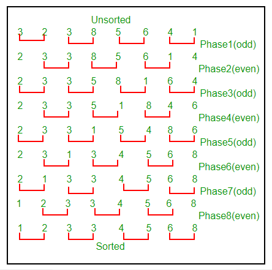

Odd-Even Sort / Brick Sort

Difficulty Level : Easy

This is basically a variation of bubble-sort. This algorithm is divided into two phases- Odd and Even Phase. The algorithm runs until the array elements are sorted and in each iteration two phases occurs- Odd and Even Phases.
In the odd phase, we perform a bubble sort on odd indexed elements and in the even phase, we perform a bubble sort on even indexed elements.

We demonstrate the above algorithm using the below illustration on the array = {3, 2, 3, 8, 5, 6, 4, 1}

Time Complexity : O(N2) where, N = Number of elements in the input array.

Auxiliary Space : O(1). Just like bubble sort this is also an in-place algorithm.