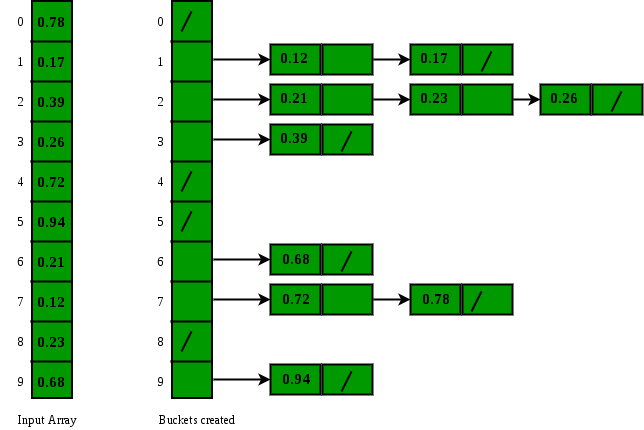

Bucket Sort

Bucket sort is mainly useful when input is uniformly distributed over a range. For example, consider the following problem.
Sort a large set of floating point numbers which are in range from 0.0 to 1.0 and are uniformly distributed across the range. How do we sort the numbers efficiently?
A simple way is to apply a comparison based sorting algorithm. The lower bound for Comparison based sorting algorithm (Merge Sort, Heap Sort, Quick-Sort .. etc) is Ω(n Log n), i.e., they cannot do better than nLogn.
Can we sort the array in linear time? Counting sort can not be applied here as we use keys as index in counting sort. Here keys are floating point numbers.  
The idea is to use bucket sort. Following is bucket algorithm.

Time Complexity: If we assume that insertion in a bucket takes O(1) time then steps 1 and 2 of the above algorithm clearly take O(n) time. The O(1) is easily possible if we use a linked list to represent a bucket (In the following code, C++ vector is used for simplicity). Step 4 also takes O(n) time as there will be n items in all buckets.
The main step to analyze is step 3. This step also takes O(n) time on average if all numbers are uniformly distributed (please refer CLRS book for more details)
Following is the implementation of the above algorithm.
