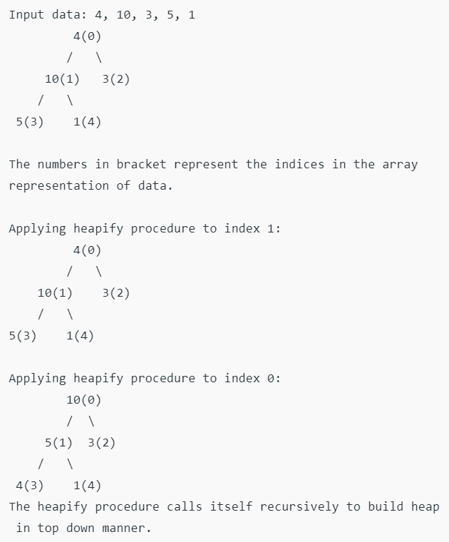
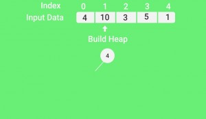
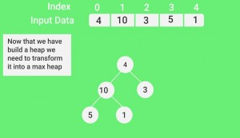
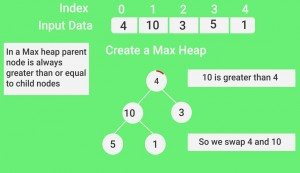
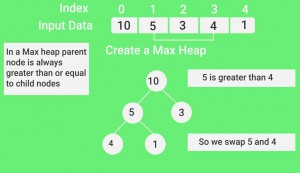
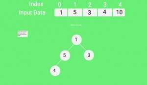
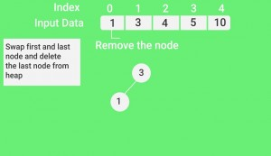

Heap sort is a comparison based sorting technique based on Binary Heap data structure. It is similar to selection sort where we first find the minimum element and place the minimum element at the beginning. We repeat the same process for the remaining elements.

What is Binary Heap?
Let us first define a Complete Binary Tree. A complete binary tree is a binary tree in which every level, except possibly the last, is completely filled, and all nodes are as far left as possible (Source Wikipedia)
A Binary Heap is a Complete Binary Tree where items are stored in a special order such that value in a parent node is greater(or smaller) than the values in its two children nodes. The former is called as max heap and the latter is called min-heap. The heap can be represented by a binary tree or array.

Why array based representation for Binary Heap?
Since a Binary Heap is a Complete Binary Tree, it can be easily represented as an array and the array-based representation is space-efficient. If the parent node is stored at index I, the left child can be calculated by 2 * I + 1 and right child by 2 * I + 2 (assuming the indexing starts at 0).

Heap Sort Algorithm for sorting in increasing order:
1. Build a max heap from the input data.
2. At this point, the largest item is stored at the root of the heap. Replace it with the last item of the heap followed by reducing the size of heap by 1. Finally, heapify the root of the tree.
3. Repeat step 2 while size of heap is greater than 1.

How to build the heap?
Heapify procedure can be applied to a node only if its children nodes are heapified. So the heapification must be performed in the bottom-up order.
Lets understand with the help of an example:

Notes:
Heap sort is an in-place algorithm.
Its typical implementation is not stable, but can be made stable (See this)

Time Complexity: Time complexity of heapify is O(Logn). Time complexity of createAndBuildHeap() is O(n) and overall time complexity of Heap Sort is O(nLogn).
Heap sort algorithm has limited uses because Quicksort and Mergesort are better in practice. Nevertheless, the Heap data structure itself is enormously used.

