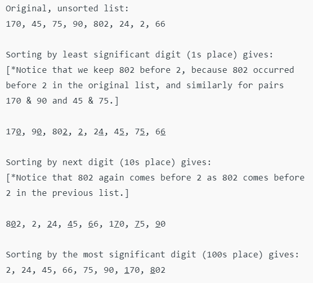
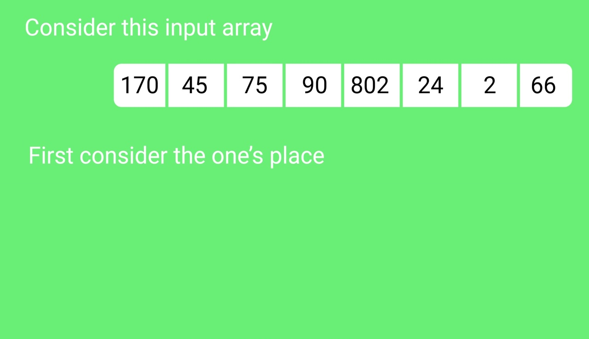
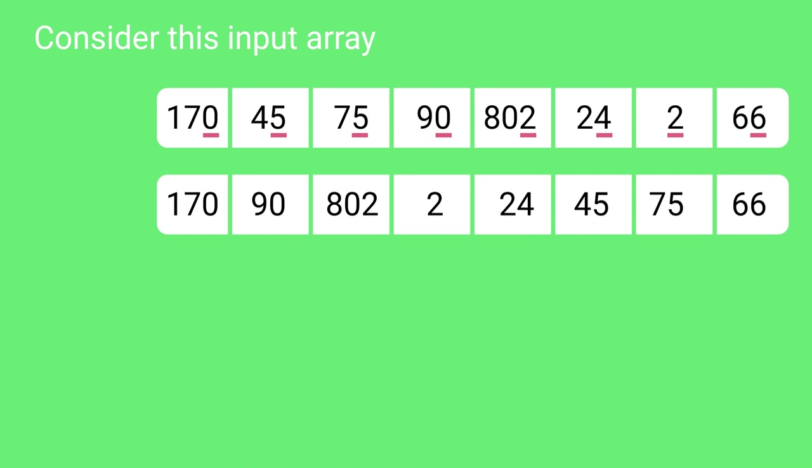
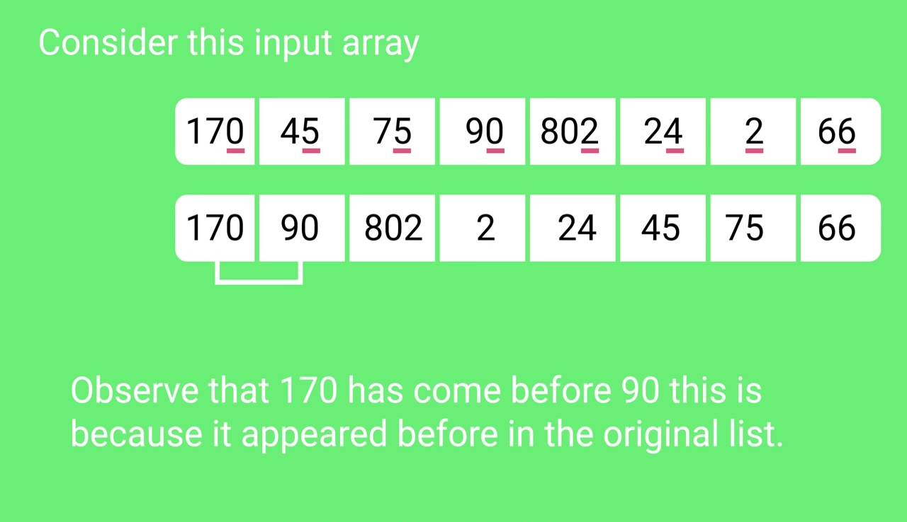
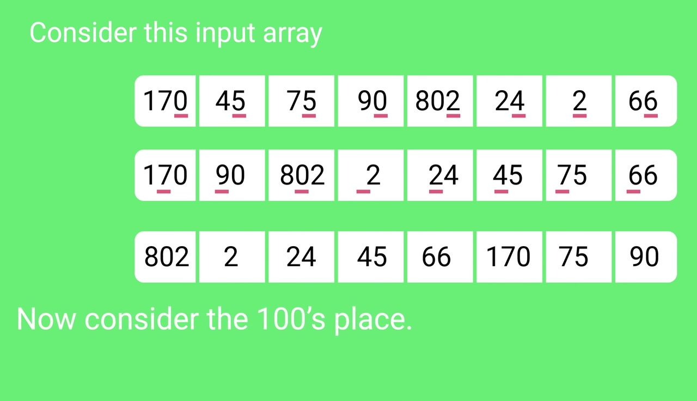

Radix Sort

The lower bound for Comparison based sorting algorithm (Merge Sort, Heap Sort, Quick-Sort .. etc) is Ω(nLogn), i.e., they cannot do better than nLogn.

Counting sort is a linear time sorting algorithm that sort in O(n+k) time when elements are in the range from 1 to k.

What if the elements are in the range from 1 to n2?
We can’t use counting sort because counting sort will take O(n2) which is worse than comparison-based sorting algorithms. Can we sort such an array in linear time?

Radix Sort is the answer. The idea of Radix Sort is to do digit by digit sort starting from least significant digit to most significant digit. Radix sort uses counting sort as a subroutine to sort.

Do following for each digit i where i varies from least significant digit to the most significant digit.
Sort input array using counting sort (or any stable sort) according to the i’th digit.

What is the running time of Radix Sort?
Let there be d digits in input integers. Radix Sort takes O(d*(n+b)) time where b is the base for representing numbers, for example, for the decimal system, b is 10. What is the value of d? If k is the maximum possible value, then d would be O(logb(k)). So overall time complexity is O((n+b) * logb(k)). Which looks more than the time complexity of comparison-based sorting algorithms for a large k. Let us first limit k. Let k <= nc where c is a constant. In that case, the complexity becomes O(nLogb(n)). But it still doesn’t beat comparison-based sorting algorithms.
What if we make the value of b larger?. What should be the value of b to make the time complexity linear? If we set b as n, we get the time complexity as O(n). In other words, we can sort an array of integers with a range from 1 to nc if the numbers are represented in base n (or every digit takes log2(n) bits).

Is Radix Sort preferable to Comparison based sorting algorithms like Quick-Sort?
If we have log2n bits for every digit, the running time of Radix appears to be better than Quick Sort for a wide range of input numbers. The constant factors hidden in asymptotic notation are higher for Radix Sort and Quick-Sort uses hardware caches more effectively. Also, Radix sort uses counting sort as a subroutine and counting sort takes extra space to sort numbers.

