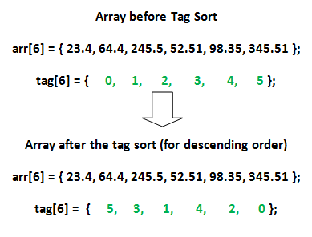
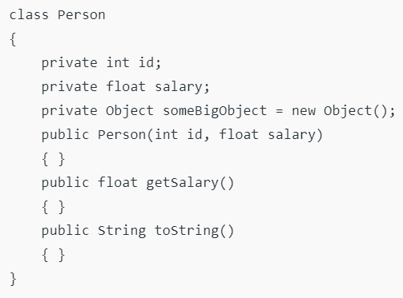

Tag Sort (To get both sorted and original)

Difficulty Level : Easy

This is not a new sorting algorithm, but an idea when we need to avoid swapping of large objects or need to access elements of a large array in both original and sorted orders.

A common sorting task is to sort elements of an array using a sorting algorithm like Quick Sort, Bubble Sort.. etc, but there may be times when we need to keep the actual array in tact and use a “tagged” array to store the correct positioning of the array when it is sorted. When we want to access elements in sorted way, we can use this “tagged” array.

Why to use Tag Sort?

When we are operating on large array of objects, it might be too costly to swap these large object. After all its about the disk swaps and we want to minimize it!

Tag Sort allows sorting an integer array after tagging it with original object.

In turn, we only swap the tag array integers instead of large array of objects.

The actual elements are not being changed during the sort process. The positions in the tag array are being changed so they will hold the correct ordering of the elements when they are sorted.

In this example, the original elements in arr[] are not changed, but the original elements in tag[] are manipulated. The tag[] array will now hold the correct subscript ordering of the elements in arr[] so the array can be sorted into descending order when the tag[] array is called upon.

Another Example, Suppose we have following Person object which inherently takes large chunk of memory( in GB or hundreds of MB).

Hence, it might not be practical to move around these objects as disk seeks for swaps can eat up a lot of time. To avoid this, we start by creating a tag array.

Every Person object is tagged to one element in the tag array and Instead of swapping the person object for sorting based on salary , we swap the tag[] integers.

While printing the sorted array we take a cue from the tag array to print the sorted Persons array.

Eventually, we’ll escape swapping large Persons object.

